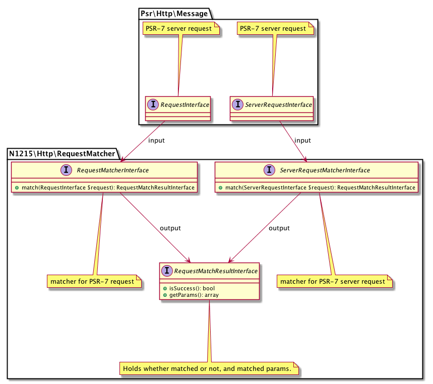

# http-request-matcher

[](https://packagist.org/packages/n1215/http-request-matcher)
[](https://packagist.org/packages/n1215/http-request-matcher)
[](https://scrutinizer-ci.com/g/n1215/http-request-matcher/build-status/master)
[](https://scrutinizer-ci.com/g/n1215/http-request-matcher/?branch=master)
[](https://scrutinizer-ci.com/g/n1215/http-request-matcher/?branch=master)

Matcher interface for PSR-7 HTTP request, like preg_match() for string.

## Usage

```php

// 1. implement RequestMatcherInterface or ServerRequestMatcherInterface. you can use RequestMatchResult concrete class.

class YourServerRequestMatcher implements ServerRequestMatcherInterface
{
    public function match(ServerRequestInterface $request): RequestMatchResultInterface
    {
        // implement
    }
}

// 2. use for PSR-7 Request
$matcher = new YourServerRequestMatcher();

/** @var \Psr\Http\Message\ServerRequestInterface $request */
$result = $matcher->match($request);

if ($result->isSuccess()) {
    var_dump($result->getParams());
}

```

## Implementation examples
* see [test](tests/RequestMatcherTest.php)
* [n1215/hakudo : MethodAndPathMatcher](https://github.com/n1215/hakudo/blob/v0.2.0/src/RequestMatcher/MethodAndPathMatcher.php)

## Class diagram


